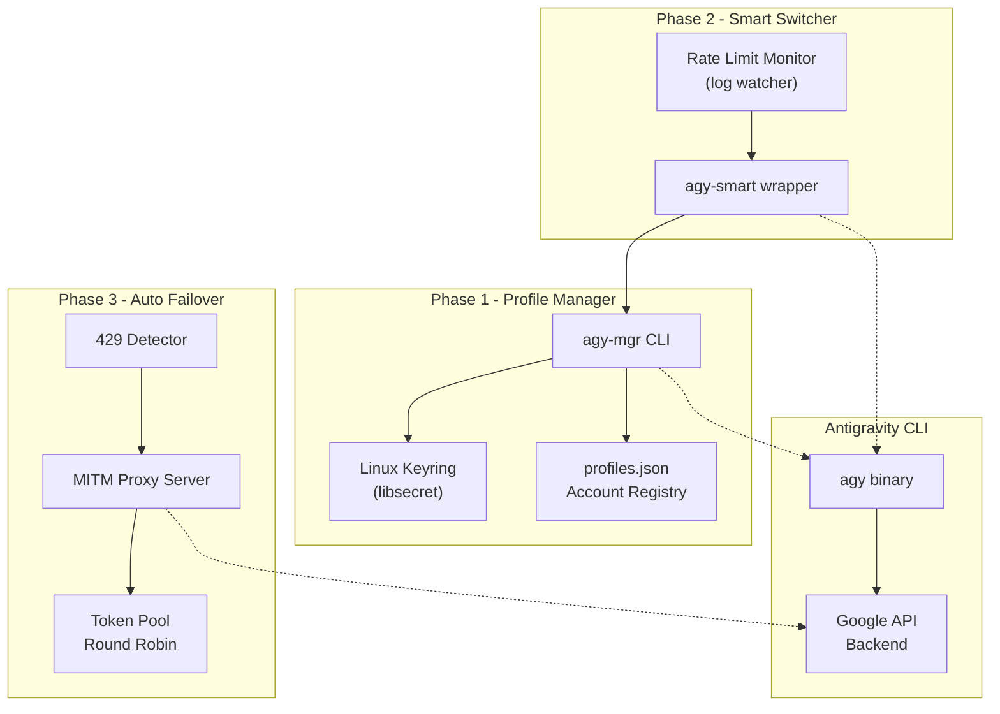
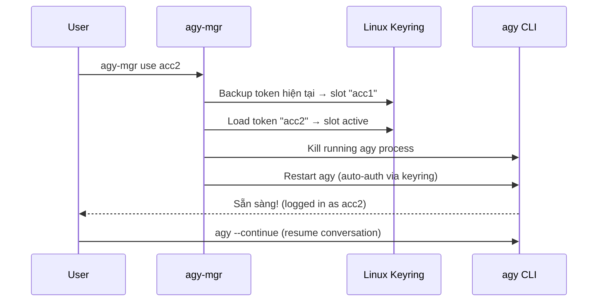
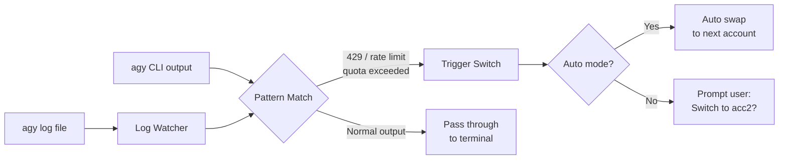
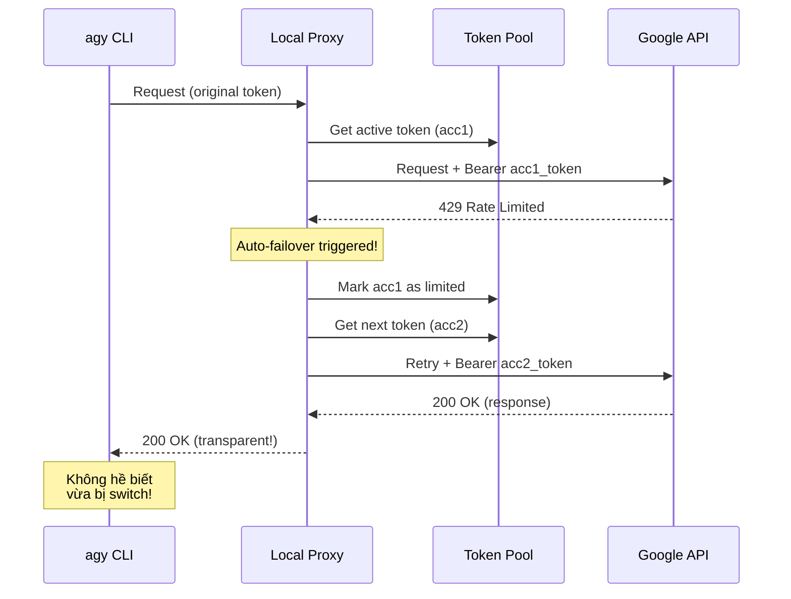
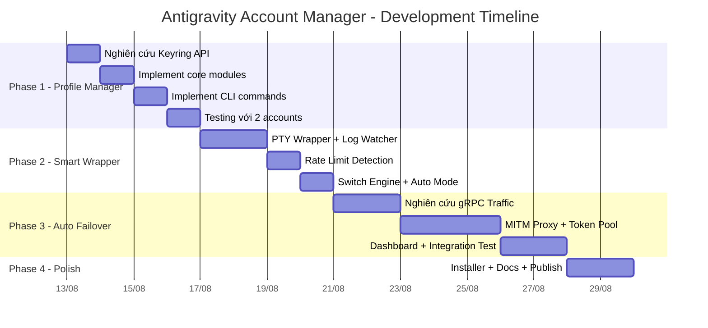

# 🚀 Antigravity Account Manager — Project Roadmap

## Tổng quan Dự án

**Mục tiêu:** Xây dựng phần mềm quản lý đa tài khoản Antigravity, cho phép tự động/thủ công chuyển đổi tài khoản khi gặp Rate Limit, giúp workflow không bị gián đoạn.

**Vị trí dự án:** [`/mnt/181EC3061EC2DBBE/DT/Code/PJ/antigravity-account-manager`](file:///mnt/181EC3061EC2DBBE/DT/Code/PJ/antigravity-account-manager)

---

## Phát hiện Kỹ thuật Quan trọng

Qua nghiên cứu hệ thống Antigravity CLI trên máy, đã xác định được:

| Thành phần | Chi tiết |
|:---|:---|
| **Auth Backend** | OAuth2 flow, token lưu qua **Linux Keyring** (GNOME Keyring / libsecret) |
| **Auth Log** | `ChainedAuth: authenticated via keyring (effective: keyring)` |
| **OAuth Module** | `auth_provider.go` → `server_oauth.go` → `auth.go` |
| **Email hiện tại** | `nguyenxuanson24042005@gmail.com` (consumer auth) |
| **CLI Binary** | ELF 64-bit Go binary tại `/home/samer/.local/bin/agy` |
| **Config** | [`~/.gemini/antigravity-cli/settings.json`](file:///home/samer/.gemini/antigravity-cli/settings.json) |
| **Conversation DB** | `~/.gemini/antigravity-cli/conversation_summaries.db` (SQLite) |
| **Resume cơ chế** | `agy --continue` hoặc `agy --conversation <ID>` |

> [!IMPORTANT]
> AGY lưu OAuth token trong **Linux Keyring** (không phải file JSON thường). Điều này ảnh hưởng lớn đến cách chúng ta quản lý đa tài khoản — cần thao tác với keyring API thay vì đơn giản swap file.

---

## Kiến trúc Tổng thể



---

## Phase 1 — Profile Manager CLI (MVP)
> **Timeline:** 2-3 ngày · **Độ khó:** ⭐⭐ · **Khả thi:** 95%

### Mục tiêu
Tạo công cụ CLI `agy-mgr` để quản lý nhiều tài khoản Antigravity. Hỗ trợ lưu/swap credentials qua keyring.

### Tính năng

| # | Feature | Mô tả |
|:--|:--------|:------|
| 1.1 | `agy-mgr add <name>` | Đăng nhập tài khoản mới, gán tên profile, lưu token vào keyring với prefix riêng |
| 1.2 | `agy-mgr list` | Liệt kê tất cả profile: tên, email, trạng thái active, thời gian limit gần nhất |
| 1.3 | `agy-mgr use <name>` | Chuyển profile active: swap token trong keyring → restart agy session |
| 1.4 | `agy-mgr remove <name>` | Xóa profile khỏi registry và keyring |
| 1.5 | `agy-mgr status` | Hiển thị tài khoản đang active + thông tin quota nếu có |

### Kiến trúc Kỹ thuật

```
antigravity-account-manager/
├── package.json
├── bin/
│   └── agy-mgr.js              # CLI entry point (#!/usr/bin/env node)
├── src/
│   ├── keyring-manager.js       # Đọc/ghi Linux Keyring qua libsecret/dbus
│   ├── profile-store.js         # Quản lý profiles.json (registry)
│   ├── agy-controller.js        # Điều khiển agy CLI (logout/login/restart)
│   └── cli.js                   # Commander.js CLI interface
├── config/
│   └── profiles.json            # Account registry (không chứa token!)
└── tests/
    └── keyring.test.js
```

### Cơ chế Swap Tài Khoản



### Milestone Checklist

- [ ] **M1.1** — Nghiên cứu keyring API: Xác định chính xác service name + attribute key mà agy dùng để lưu OAuth token trong Linux Keyring
- [ ] **M1.2** — Implement `keyring-manager.js`: Module đọc/ghi/swap token qua D-Bus Secret Service API hoặc `keytar` npm package
- [ ] **M1.3** — Implement `profile-store.js`: Lưu trữ metadata profile (tên, email, ngày tạo) trong `profiles.json`
- [ ] **M1.4** — Implement `agy-controller.js`: Điều khiển lifecycle agy CLI (detect running process, graceful kill, restart)
- [ ] **M1.5** — Implement CLI commands: `add`, `list`, `use`, `remove`, `status`
- [ ] **M1.6** — Testing: Thử swap giữa 2 tài khoản thật, verify `agy --continue` vẫn hoạt động

### Rủi ro & Giải pháp

| Rủi ro | Xác suất | Giải pháp |
|:-------|:---------|:---------|
| AGY dùng keyring attribute không rõ ràng | Trung bình | Strace/ltrace quá trình login để tìm chính xác attribute key |
| Token format thay đổi giữa các version | Thấp | Lưu raw blob, không parse nội dung token |
| Keyring bị lock khi swap | Thấp | Unlock keyring trước khi thao tác |

---

## Phase 2 — Smart Wrapper & Rate Limit Detection
> **Timeline:** 3-4 ngày · **Độ khó:** ⭐⭐⭐ · **Khả thi:** 85%

### Mục tiêu
Tạo wrapper `agy-smart` bao bọc agy CLI, tự động phát hiện Rate Limit từ log/output và đề xuất (hoặc tự động) chuyển tài khoản.

### Tính năng

| # | Feature | Mô tả |
|:--|:--------|:------|
| 2.1 | `agy-smart` wrapper | Proxy wrapper chạy agy bên trong, theo dõi output real-time |
| 2.2 | Rate Limit Detection | Parse CLI log + stderr để phát hiện lỗi 429 / quota exceeded |
| 2.3 | Interactive Switch | Khi detect limit → hỏi user có muốn chuyển account không |
| 2.4 | Auto Switch Mode | Flag `--auto-switch` để tự động chuyển mà không cần hỏi |
| 2.5 | `/switch` command | Inject custom slash command vào agy input stream |

### Kiến trúc

```
src/
├── smart-wrapper.js         # PTY wrapper cho agy CLI
├── rate-limit-detector.js   # Pattern matching trên output stream
├── switch-engine.js         # Logic chọn account tiếp theo
└── log-watcher.js           # Tail -f agy log file real-time
```

### Cơ chế Phát hiện Rate Limit



### Milestone Checklist

- [ ] **M2.1** — Implement PTY wrapper: Dùng `node-pty` để wrap agy CLI, giữ nguyên terminal behavior (colors, cursor, interactive input)
- [ ] **M2.2** — Implement Rate Limit Detector: Thu thập các pattern lỗi rate limit từ agy (cần gây limit thật để capture pattern)
- [ ] **M2.3** — Implement Switch Engine: Kết nối với Phase 1 Profile Manager, chọn account chưa bị limit
- [ ] **M2.4** — Implement Interactive Mode: Hiển thị prompt khi detect limit
- [ ] **M2.5** — Implement Auto Mode: Flag `--auto-switch` cho chuyển đổi tự động
- [ ] **M2.6** — Implement `/switch` injection: Parse input từ user, intercept `/switch` command trước khi gửi đến agy
- [ ] **M2.7** — Cooldown tracking: Ghi nhận thời điểm bị limit của mỗi account, ước lượng khi nào hết limit

---

## Phase 3 — Auto-Failover Proxy (Advanced)
> **Timeline:** 5-7 ngày · **Độ khó:** ⭐⭐⭐⭐ · **Khả thi:** 70-80%

### Mục tiêu
Xây dựng Local Proxy Server đứng giữa agy CLI và Google API Backend. Tự động phát hiện 429 và retry với token tài khoản khác — hoàn toàn trong suốt với người dùng.

### Tính năng

| # | Feature | Mô tả |
|:--|:--------|:------|
| 3.1 | HTTPS Proxy Server | Local MITM proxy intercept traffic giữa agy ↔ Google API |
| 3.2 | Token Pool | Quản lý pool N OAuth tokens, round-robin hoặc least-recently-limited |
| 3.3 | Auto Retry | Bắt response 429, swap token header, retry request tự động |
| 3.4 | Health Dashboard | Web UI hiển thị trạng thái từng account (active/limited/cooldown) |
| 3.5 | Zero Config | Tự động configure `https_proxy` env var khi start |

### Kiến trúc

```
src/
├── proxy-server.js          # HTTPS MITM proxy (http-mitm-proxy hoặc custom)
├── token-pool.js            # Quản lý N access tokens + refresh logic
├── failover-engine.js       # 429 detection → token rotation → retry
├── oauth-refresher.js       # Tự động refresh expired access tokens
├── dashboard.html           # Web UI dashboard
└── config.js                # Load config từ profiles
```

### Cơ chế Failover



### Thách thức Kỹ thuật

> [!WARNING]
> Phase này có thách thức lớn nhất: AGY sử dụng **gRPC over TLS** (không phải HTTP REST đơn thuần). MITM proxy cho gRPC cần xử lý HTTP/2 framing, certificate pinning, và streaming bidirectional.

| Thách thức | Mức độ | Giải pháp đề xuất |
|:-----------|:-------|:------------------|
| gRPC over TLS | Cao | Dùng `mitmproxy` (Python) có hỗ trợ HTTP/2, hoặc custom Go proxy |
| Certificate Pinning | Trung bình | Kiểm tra xem agy có pin cert không; nếu có thì cần patch hoặc dùng env var `SSL_CERT_FILE` |
| Token format complexity | Trung bình | Capture OAuth refresh flow, replicate bằng googleapis client |
| Session state consistency | Trung bình | Đảm bảo conversation context không bị ảnh hưởng khi đổi token |

### Milestone Checklist

- [ ] **M3.1** — Nghiên cứu gRPC traffic: Dùng mitmproxy/Wireshark capture traffic giữa agy ↔ backend, xác định endpoints và auth header format
- [ ] **M3.2** — Implement Proxy Server: HTTP/2-capable MITM proxy với TLS termination
- [ ] **M3.3** — Implement Token Pool: Quản lý multi-account tokens với status tracking
- [ ] **M3.4** — Implement Failover Engine: 429 detection → token swap → transparent retry
- [ ] **M3.5** — Implement OAuth Refresher: Tự động refresh expired access tokens cho mỗi account
- [ ] **M3.6** — Implement Web Dashboard: Real-time status UI
- [ ] **M3.7** — Integration Testing: Test end-to-end với 2+ tài khoản thật
- [ ] **M3.8** — Kiểm tra certificate pinning & tìm giải pháp bypass nếu cần

---

## Phase 4 — Polish & Distribution
> **Timeline:** 2-3 ngày · **Độ khó:** ⭐⭐ · **Khả thi:** 95%

### Tính năng

| # | Feature | Mô tả |
|:--|:--------|:------|
| 4.1 | Installer script | One-line install: `curl ... \| bash` |
| 4.2 | Systemd service | Auto-start proxy khi boot (cho Phase 3) |
| 4.3 | Shell alias | `alias agy="agy-smart"` tự động inject |
| 4.4 | Documentation | README.md toàn diện + GIF demo |
| 4.5 | npm publish | Publish lên npm registry |

---

## Timeline Tổng thể



---

## Tech Stack Đề xuất

| Layer | Technology | Lý do |
|:------|:-----------|:------|
| **Runtime** | Node.js 20+ | Đã có sẵn trên máy, ecosystem npm mạnh |
| **CLI Framework** | `commander.js` | Lightweight, dễ dùng |
| **Keyring Access** | `keytar` hoặc D-Bus bindings | Tương tác Linux Keyring |
| **PTY Wrapper** | `node-pty` | Giữ nguyên terminal UX khi wrap agy |
| **Proxy (Phase 3)** | `mitmproxy` (Python) hoặc Go custom | Hỗ trợ HTTP/2 + gRPC tốt nhất |
| **Dashboard** | Vanilla HTML + CSS | Nhẹ, không dependency |

---

## Quyết định cần User Input

> [!IMPORTANT]
> Trước khi bắt tay code, cần xác nhận một số điểm:

1. **Ngôn ngữ chính:** Node.js hay Python cho toàn bộ dự án?
2. **Bắt đầu từ Phase nào?** Khuyến nghị Phase 1 → 2 → 3 tuần tự, nhưng nếu muốn nhảy thẳng Phase 3 cũng được.
3. **Số lượng tài khoản dự kiến:** 2-3 hay nhiều hơn? (ảnh hưởng đến thiết kế token pool)
4. **Bạn có sẵn 2+ tài khoản Google** để test ngay không?
